# Zeno House — a sim-ready multi-room house for the Zeno Malo mobile manipulator

An Isaac Sim house with baked physics, **ground-truth (GT) annotations for every
asset**, **annotation-driven manipulation skills** (IK + grasp selection + base
planning), and **five household task scenes**. The house is an Infinigen layout.
Every task object was generated with [EmbodiedGen V2](https://github.com/HorizonRobotics/EmbodiedGen)
text-to-3D.

<p align="center">
  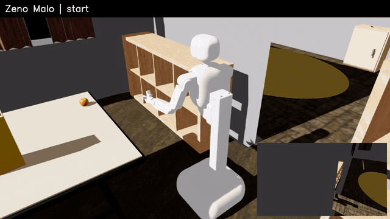
  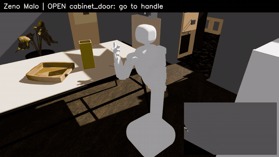
</p>
<p align="center"><sub>
Left: pick the orange → A* around the dining table → place it in the basket (3 cm from its centre).
Right: drive through the dining/living-room doorway → open the cabinet door to 80° → close it.
Everything is computed from the annotations: no hand-tuned base poses or grasps.
Full 98 s video: <a href="media/zeno_house_demo.mp4">media/zeno_house_demo.mp4</a>
</sub></p>

Physics is real PhysX contact. The rollout only ever writes the robot's joint-drive targets and
the base anchor. Objects and doors are never teleported, and success is measured from the
simulator state (joint angle, object pose, finger gap).

---

## Contents

- [Scenes](#scenes)
- [Tasks covered](#tasks-covered)
- [GT annotations](#gt-annotations-ik--grasp--rl)
- [Skills](#skills)
- [Physics fixes baked into the scene](#physics-fixes-baked-into-the-scene)
- [Quick start](#quick-start)
- [Rebuild pipeline](#rebuild-pipeline)
- [Repository layout](#repository-layout)
- [Limitations](#limitations)

---

## Scenes

One house (`sim/zeno_house.usd`) contains 10 rooms, 58 pieces of static furniture, 15
articulated cabinets and drawers, a microwave and the Zeno Malo robot. Each task scene is a thin
USD layer on top of it (`tasks/<task>/scene.usd`). The rooms themselves are never modified; a
task only adds assets to furniture tops or to the floor.

| | |
|---|---|
|  House, top-down (roofless) |  Articulated cabinet with side-hook handle, living room |
| 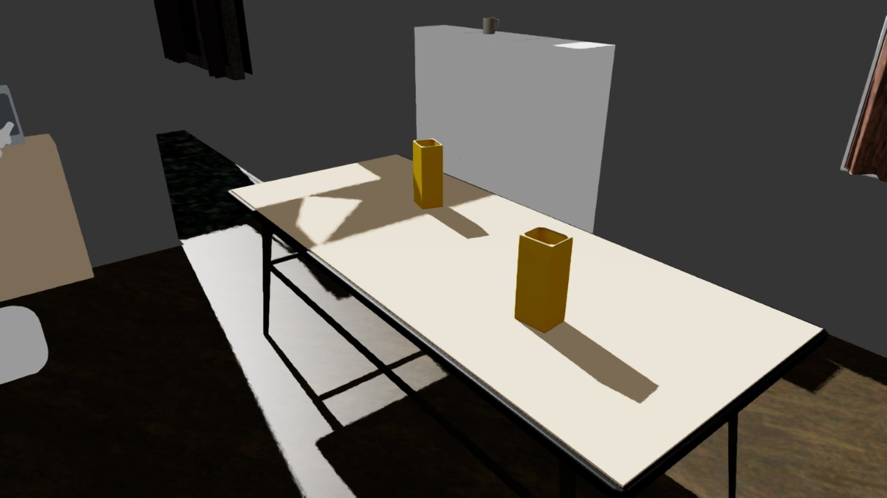 **breakfast_setup**: dining table with clutter (cereal boxes) and cups | 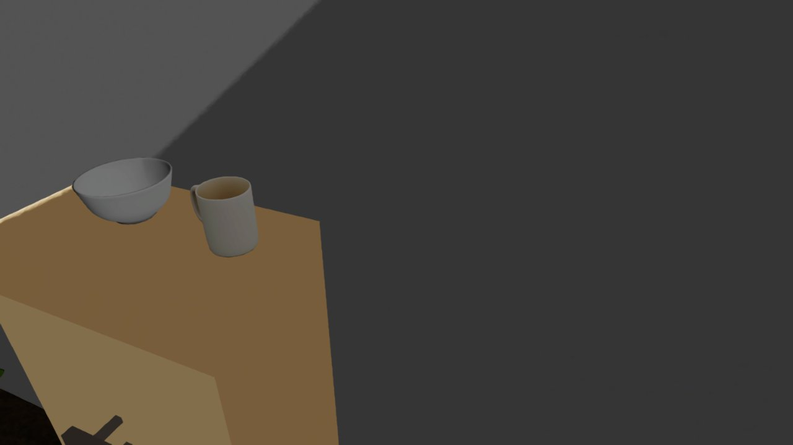 **breakfast_setup**: bowl and mug on a kitchen surface |
| 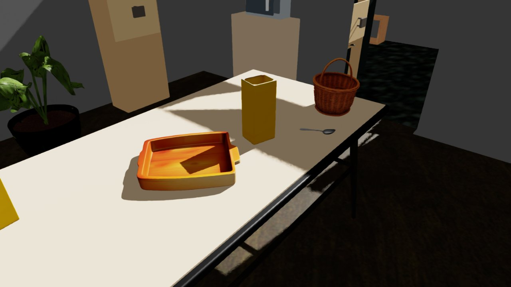 **collect_fruits**: basket, fallback tray and clutter on the dining table | 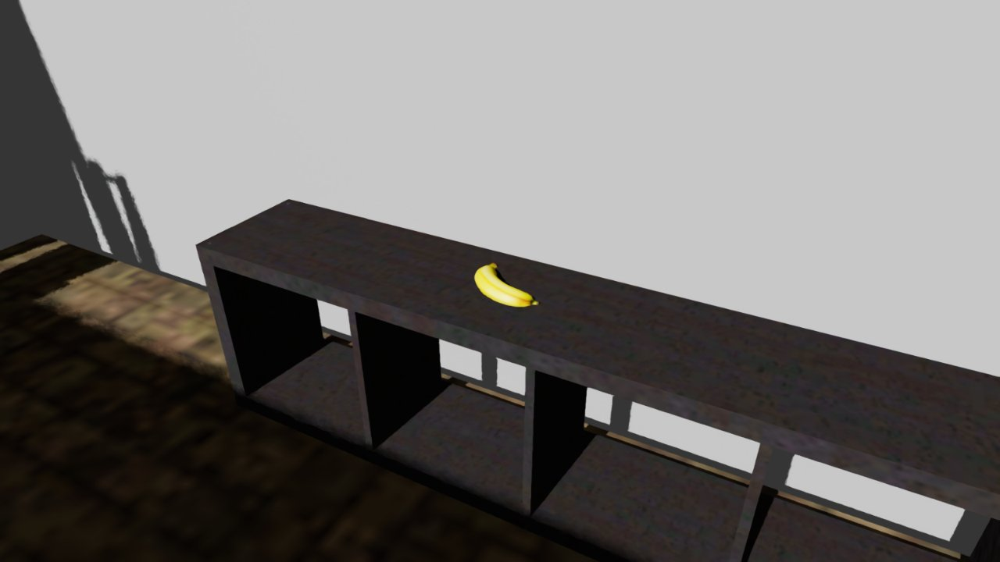 **collect_fruits**: banana on the living-room TV stand |
| 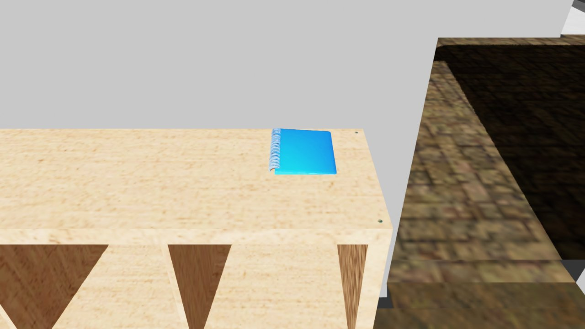 **desk_prep**: notebook on a shelf in another room | 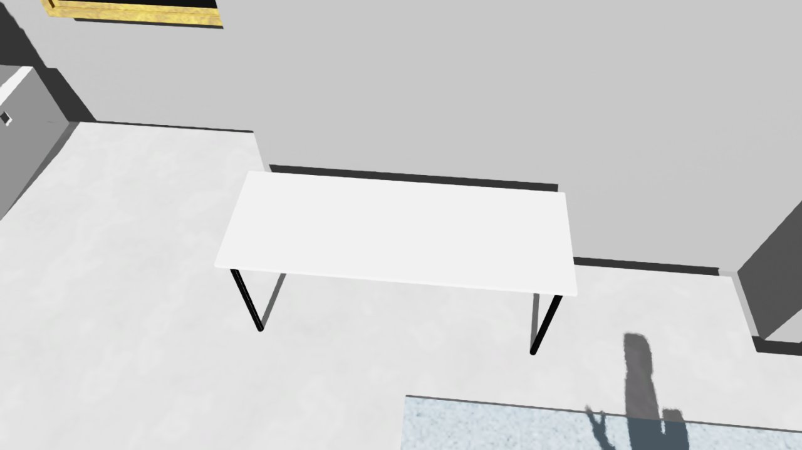 **desk_prep**: target desk in the bedroom |
| 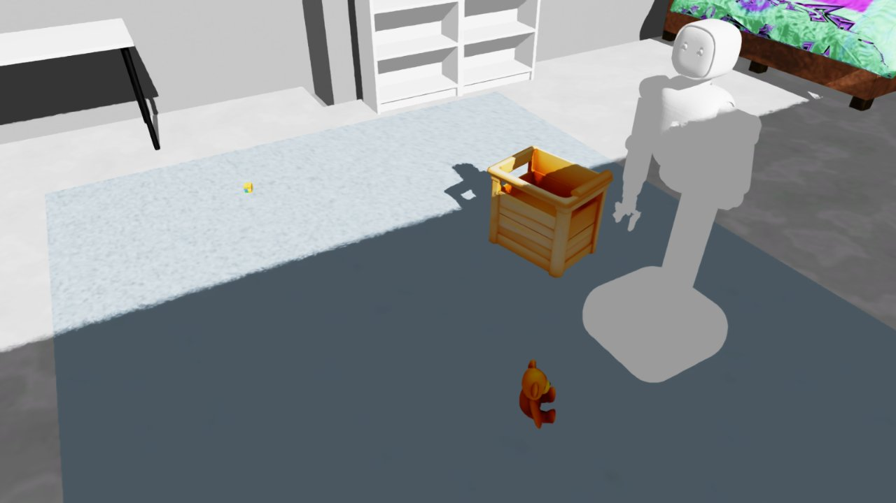 **tidy_toys**: toy box, teddy bear, blocks and Zeno | 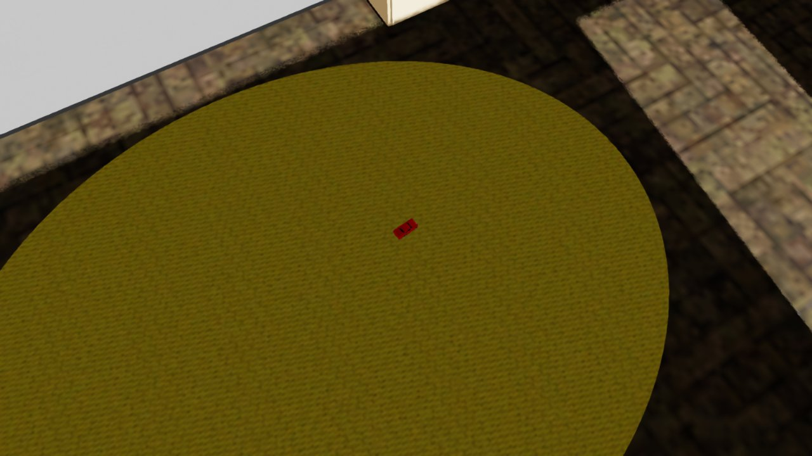 **tidy_toys**: toy car on the living-room rug |
| 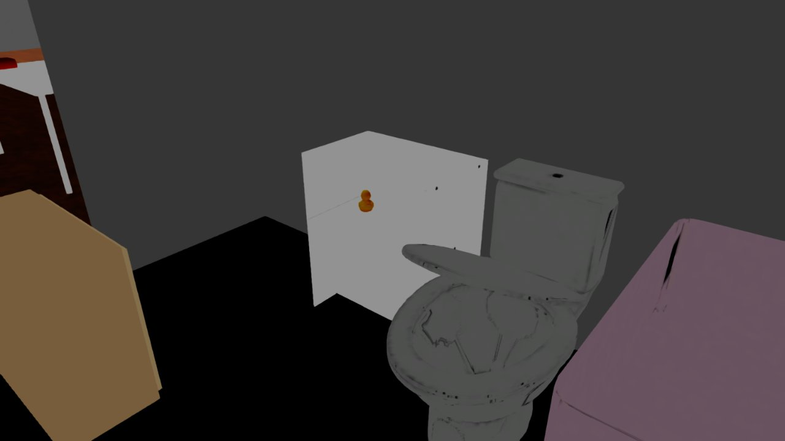 **shelve_books**: bookcase, middle shelf blocked by a duck | 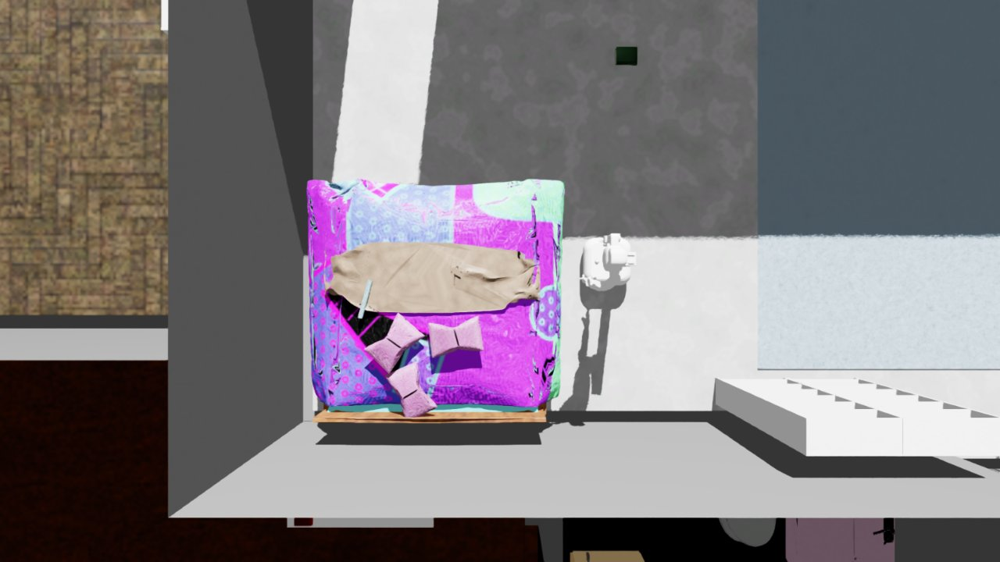 **shelve_books**: books on the desk, bed and floor (top-down) |

Every scene passes a physics check: after 3 s of simulation every free body has drifted less
than 1 cm, every articulated part stays closed and the robot holds its pose (see
`sim/checks/`, `tasks/*/check/`).

---

## Tasks covered

### Built task scenes

Each task ships as `tasks/<task>/{scene.usd, task.json, annotation.json}`. `task.json` holds the
instruction, the objects and their candidate supports, the alternatives/recovery branches, the
success conditions and the seed. `tools/build_tasks.py --task T --seed N` samples a new variant:
it picks the support and pose for each object (collision-free, near an edge so Zeno can reach
it) and drops optional objects to trigger the alternatives.

| Task | Instruction | Objects (EmbodiedGen V2) | Alternatives / recovery | Success condition |
|---|---|---|---|---|
| **breakfast_setup** 整理早餐餐具 | Set up the dining table for breakfast. | plate, bowl, cup, mug, spoon, cereal boxes (clutter) | plate missing → bowl; cup missing → mug; spot occupied → clear the clutter first | plate\|bowl, cup\|mug and spoon on the dining table |
| **collect_fruits** 收集水果 | Collect the fruits and place them in a container on the dining table. | apple, banana, orange, fruit_basket, serving_tray | basket missing → tray | all fruits in the container; container on the dining table |
| **desk_prep** 准备工作桌 | Prepare the desk with a notebook, a pen, and a mug. | notebook, pen, pencil (+ mugs, cups) | mug → cup; pen → pencil | notebook, pen\|pencil and mug\|cup on the desk |
| **tidy_toys** 收拾玩具 | Collect the toys and store them in the toy box. | toy_car, teddy_bear, toy_block, rubber_duck, toy_box, storage_basket | toy box missing → storage basket | all toys in the container |
| **shelve_books** 整理书籍 | Collect the books and place them on the bookshelf. | book_red, book_green, book_blue (+ duck blocking a shelf) | shelf occupied → other level or bookcase; book too flat → push to an edge, then grasp | all books on a bookcase |

### Coverage of the household task list with the current house and assets

| Task | Status |
|---|---|
| 整理早餐餐具 / 收集水果 / 准备工作桌 / 收拾玩具 / 整理书籍 | ✅ built (above) |
| 给客人准备物品 (book + cup to the guest table) | 🟡 all assets and annotations exist; add a `TASKS` entry |
| 搬运多个物体 (counter → storage table, tray-assisted) | 🟡 tray and objects exist; add a `TASKS` entry |
| 清理餐桌 (plate, cup, book, box on the table → put away) | 🟡 all but "trash" exist |
| 整理储物架 (sort shelf objects by category) | 🟡 shelves and annotated shelf levels exist; categories come from asset `tags` |
| 准备野餐篮 (items into a basket → front door) | 🟡 basket, plate and cup exist; needs napkin and snack-box assets |
| 整理购物物品 / 收集空容器 | ⬜ needs cans and bottles (one `text3d-cli` call) |
| 整理鞋子 / 整理卧室杂物 (shoes) | ⬜ needs shoe assets |
| 准备机器人工作区 (screwdriver, tape, tool case) | ⬜ needs tool assets |

New assets go through the same pipeline (`assets/gen_v2_assets.sh` → `tools/prepare_assets.py`
→ `tools/fix_textures.py`). A new task is one entry in `TASKS` in `tools/build_tasks.py`.

---

## GT annotations (IK + grasp + RL)

**Every object in every scene has an asset annotation, and every articulated part has a handle
frame.** These give a scripted IK + grasp policy everything it needs, and can serve as
privileged observations and dense rewards for RL.

<p align="center"></p>

`annotations/assets.json` holds one entry per asset type, in the object frame:
- size, mass, tags (e.g. `fruit`, `container`, `book`)
- the origin → bottom-centre offset
- the container wall profile (rim radius and height)
- grasp primitives for the Zeno 8 cm pinch gripper:
  - `rim_pinch` / `rim_pinch_rect`: containers. Pinch the wall at the rim; candidates over rim
    azimuth × approach tilt.
  - `top_pinch`: vertical approach across the narrowest cross-section. The cross-section is found
    by sliding a pad-wide slab along the object, so bananas, pens and cars work; `offset_xy`
    gives the pinch point.
  - `edge_pinch_after_push`: flat objects wider than the gripper (plate, books, notebook).
  - Assets marked not graspable by Zeno: cereal box, teddy bear.

<p align="center"></p>

`annotations/<scene>.json` and `tasks/*/annotation.json` are per scene, in the world frame:

| key | content |
|---|---|
| `rooms` | floor triangles (point-in-room queries) |
| `obstacles` | 58 furniture AABBs, cabinet bodies, 1874 wall segments |
| `supports` | 233 horizontal surfaces (table tops, desk tops, every shelf level): height, extent, vertical clearance |
| `articulated` | 16 doors/drawers: joint path, type, pivot, axis, limits, open/closed value, moving-part boxes, handle frame (centre, outward normal, along-face direction, bar size) |
| `objects` | prim, rigid-body path, asset type, pose, AABB, room, supporting surface |

Python helpers (`zeno_skills/annotations.py`):

```python
ann = SceneAnnotations("tasks/collect_fruits/annotation.json")
ann.grasp_poses(ann.objects["orange"], pos, quat)          # world TCP grasp candidates
ann.handle_pose(ann.art("KitchenCabinetFactory_7025538_spawn_asset_6631478"), q)  # handle TCP pose at joint value q
ann.motion(art, q)                                         # rigid motion of the door/drawer
```

---

## Skills

`zeno_skills/` (see [`zeno_skills/SKILL.md`](zeno_skills/SKILL.md)) reads everything from the
annotations; nothing is asset-specific.

| skill | how |
|---|---|
| `navigate` | Fold the arm along a collision-checked path, plan A* over free base cells, drive the holonomic base |
| `open_articulated` / `close_articulated` | Search base poses where pre-grasp → grasp is a continuous collision-free IK path *and* the robot can ride rigidly with the door or drawer to its goal; prefer the pose with the lowest wrist torque. Side-hook grasp: one finger sits between the panel and the bar, so the pull loads the bar through the finger's normal force, not friction. Closed loop on the measured joint value. |
| `pick` | Grasp candidates at the object's current pose, a base pose per candidate, approach → close → lift; success = the object rose and is still between the fingers |
| `place` | Keep the measured TCP→object offset, search the object's yaw about the vertical and a base pose, lower, release; success = the object rests on the target support or container floor |

Kinematics are exact URDF FK plus analytic-Jacobian damped least-squares IK on the fingertip TCP
(about 17 ms per global solve). Collision uses a sphere model of the robot against the annotation
boxes and each moving part at its current joint value.

---

## Physics fixes baked into the scene

Each fix removes a bug found in the URDF→USD import. The code is in `zeno_skills/physics.py`.

| problem as imported | fix |
|---|---|
| All robot drives had damping 0 | Damped position drives; joint targets time-scaled to 60 % of URDF velocity limits (torso lift is 0.117 m/s) |
| Floating base on 2 N·m wheel drives: the base moved instead of the door | Base anchor joint, moved kinematically (holonomic) |
| Finger colliders (convex decomposition) fused pad and rail into a wedge, so the fingers stalled 3.4 cm open | Pad-sized box colliders, rubber friction (μ 2.0, combine = max) |
| Left arm hung into the floor when the torso lowered | Held folded |
| Containers were imported as one convex hull (a solid dome) | Walls following the mesh profile plus a base plate |
| Placeholder inertia (1, 1, 1) kg·m² | Box inertia from real size and mass |
| Rigid body nested under a rigid body (`collisions` prim) | Stripped |
| Collision API on Xforms, uneven bottoms: boxes rocked, spoons fell through | Convex hull on the collision mesh |
| Hinges with no damping; joint friction made doors un-openable | Viscous damping only on hinges; small friction on drawers |
| Objects spawned floating or interpenetrating | Drop-and-settle, rest poses written back |
| Every generated asset shared one texture file (`material_0.png`) | Per-asset textures (`tools/fix_textures.py`) |

---

## Quick start

Requirements: Isaac Sim 5.1 + Isaac Lab 2.3 (tested). For regenerating assets only: an
[EmbodiedGen](https://github.com/HorizonRobotics/EmbodiedGen) checkout (`EMBODIEDGEN_ROOT`).

```bash
git lfs install && git clone <this repo> zeno-house && cd zeno-house
export OMNI_KIT_ACCEPT_EULA=YES ISAACLAB_PYTHON=/path/to/isaaclab/python

# physics check + preview renders of a task scene
$ISAACLAB_PYTHON tools/check_scene.py tasks/collect_fruits/scene.usd --out runs/check \
    --view table 4.4 6.0 1.7 3.5 7.1 0.85

# run skills (records runs/demo/run.mp4 + result.json)
$ISAACLAB_PYTHON tools/run_skills.py --scene tasks/collect_fruits/scene.usd \
    --ann tasks/collect_fruits/annotation.json --out runs/demo \
    --plan "pick orange" "place orange in:fruit_basket 0 0" \
           "open KitchenCabinetFactory_7025538_spawn_asset_6631478" \
           "close KitchenCabinetFactory_7025538_spawn_asset_6631478"
# plan steps: open <art> | close <art> | pick <obj> | place <obj> <support|in:container> <x> <y> | goto <x> <y> <yaw>
```

Or open `sim/zeno_house.usd` or `tasks/<task>/scene.usd` in Isaac Sim with `File → Open`.

## Rebuild pipeline

```text
assets/gen_v2_assets*.sh      EmbodiedGen V2 text3d-cli (needs EMBODIEDGEN_ROOT, embodiedgen env)
tools/prepare_assets.py       real-size scaling, lay-flat alignment, grasp annotation, URDF→USD (--convert)
tools/fix_textures.py         per-asset textures (run after every --convert)
tools/settle_scene.py         drop-and-settle, write rest poses
tools/check_scene.py          physics check + renders
tools/annotate_scene.py       scene annotations (house part cached in annotations/house_static.json)
tools/build_tasks.py          task layer + task.json   (tools/make_tasks.sh = build+settle+check+annotate for all)
tools/run_skills.py           execute a skill plan, record video
```

`tools/bake_scene.py` records how `sim/zeno_house.usd` was produced from the original Infinigen
+ Zeno composition. That source is not shipped; `sim/zeno_house.usd` is the source of truth.

## Repository layout

```text
sim/zeno_house.usd      final house scene (+ sim/checks)
tasks/<task>/           task layer, task.json, annotation.json, check renders
annotations/            assets.json, zeno_house.json, house_static.json
zeno_skills/            kinematics, collision, annotations, planner, rig, skills, physics
tools/                  pipeline scripts
usd/                    house, robot and asset USDs (+ materials/textures)
assets/asset3d/         EmbodiedGen V2 asset sources (URDF + textured OBJ)
robot_sources/          Zeno Malo URDF + meshes
media/                  README media, demo videos, rollout result.json files
```

## Limitations

- Validated with rollouts: open and close of an articulated cabinet, and pick/place of tabletop
  objects, including into a container and across rooms. Floor objects, `edge_pinch_after_push`
  and complete multi-step task episodes are annotated but not yet executed.
- Kinematic holonomic base (anchor joint): no wheel dynamics.
- Robot links are gravity-compensated, like the real arm controller.
- Generated asset sizes and masses come from a spec table in `tools/prepare_assets.py`.
  EmbodiedGen's LLM sizing needs an API key that was not available.

## Acknowledgements

House layout: [Infinigen](https://github.com/princeton-vl/infinigen) (BSD-3). Assets:
[EmbodiedGen](https://github.com/HorizonRobotics/EmbodiedGen) V2 (Apache-2.0). Robot:
Zeno Malo EDU description (see `robot_sources/zeno_malo_description-master/LICENSE`).
