# Zeno House — a sim-ready multi-room house for the Zeno Malo mobile manipulator

An Isaac Sim house with baked physics, **ground-truth (GT) annotations for every
asset**, **annotation-driven manipulation skills** (IK + grasp selection + base
planning), and **eight household task specs**. The house is an Infinigen layout.
Every task object was generated with [EmbodiedGen V2](https://github.com/HorizonRobotics/EmbodiedGen)
text-to-3D.

<p align="center">
  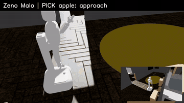
  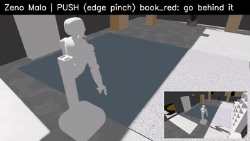
</p>
<p align="center"><sub>
Whole tasks, run by the goal-driven scripted policy and scored by the success checker (sped up).
Left: <b>collect_fruits</b>, both fruits into the basket, across two rooms.
Right: <b>shelve_books</b>, flat books pushed over the desk edge, pinched at the overhang, placed on a bookcase.
Core grasp and motion planning use annotations; appliance skills also contain scene-specific park hints.
</sub></p>

Physics is real PhysX contact. The rollout writes robot drive targets, the base anchor,
and the powered microwave hinge target. Objects and doors are never teleported; food
temperature uses a separate task-level model. Success is measured from simulator state
(joint angle, object pose, finger gap, and task temperature).

## Policy 与 contract

[GT policy 梳理](docs/GT_POLICY.md) 说明动作边界；[能力目录](docs/POLICY_CATALOG.md) 与[物理验证记录](docs/POLICY_VERIFICATION.md) 列出 64 项公开入口及各自的验证状态。[Contract 提案](docs/CONTRACT_PROPOSAL.md) 记录八类接口、具体路线及验证要求。

[关系图 PNG](docs/contract_layers_preview.png) 与 [SVG](docs/contract_layers.svg) 展示八个兼容 family Contract 和 63 个底层 Policy 的直接绑定与支撑引用。新的 [SkillNode Library](skill_library/README.md) 提供 42 个 SkillNode 与 42 个一对一 Contract；`ContractRunner` 执行 Contract 内部 policy 顺序并检查实测结果。自动技能子图规划和失败后重规划留给上层扩展。

---

## Contents

- [Policy 与 contract](#policy-与-contract)
- [Scenes](#scenes)
- [Tasks (ZenoBench)](#tasks-zenobench)
- [GT policy inventory](docs/GT_POLICY.md)
- [Policy capability catalog (with implementation status)](docs/POLICY_CATALOG.md)
- [Physical verification report](docs/POLICY_VERIFICATION.md)
- [Contract proposal (8 reusable templates)](docs/CONTRACT_PROPOSAL.md)
- [GT annotations](#gt-annotations-ik--grasp--rl)
- [Atomic skills](#atomic-skills)
- [Skills](#skills)
- [Physics fixes baked into the scene](#physics-fixes-baked-into-the-scene)
- [Quick start](#quick-start)
- [新建任务、资产、场景和标注](docs/README.md)
- [Repository layout](#repository-layout)
- [Limitations](#limitations)

---

## Scenes

One house (`sim/zeno_house.usd`) contains 10 rooms, 58 pieces of static furniture, 15
articulated cabinets and drawers, a microwave and the Zeno Malo robot. No cabinet stands in a bathroom
(the ones the layout generator put there were moved to the living and dining rooms, `tools/relocate_furniture.py`). Each task scene is a thin
USD layer on top of it (`tasks/<task>/scene.usd`); the breakfast heating tasks layer over the
appliance scene (`sim/zeno_house_appliances.usd`). The rooms themselves are never modified; a
task only adds assets to furniture tops or to the floor.

| | |
|---|---|
| 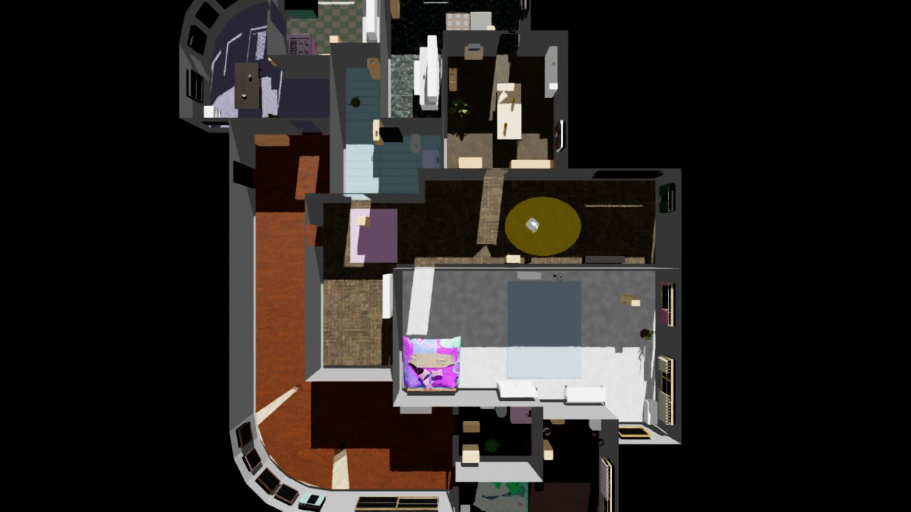 House, top-down (roofless) | 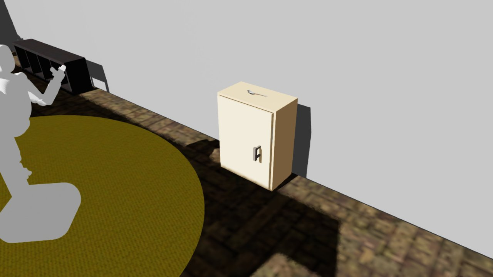 Articulated cabinet with side-hook handle, living room |

The task layouts are shown in the task videos below.

Every scene passes a physics check: after 3 s of simulation every free body has drifted less
than 1 cm, every articulated part stays closed and the robot holds its pose (see
`sim/checks/`, `tasks/*/check/`).

---

## Tasks (ZenoBench)

Each task is a spec in `task_specs/<task>.json`. `tools/build_tasks.py` samples a variant of it into
`tasks/<task>/{scene.usd, task.json, annotation.json}`. The spec gives the instruction, the objects
with their candidate supports, the alternatives, and the goal. A task is **scored by
`zeno_skills/evaluator.py`** from simulator state only, and **solved by the goal-driven scripted policy
`zeno_skills/task_policy.py`**, which turns the goal into navigation, manipulation,
and appliance skills. The [GT policy inventory](docs/GT_POLICY.md) separates this scripted
baseline from its atomic skills and evaluator. `tools/run_task.py` does evaluate → policy → evaluate, then writes `result.json` and a video.

<!-- TASK_VIDEOS -->
| task | rollout (sped up) | result |
|---|---|---|
| **collect_fruits** | <br>[video](media/tasks/collect_fruits.mp4) | **success**, progress 100%<br>186 s simulated |
| **tidy_toys** | 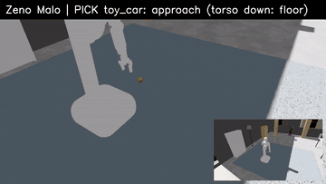<br>[video](media/tasks/tidy_toys.mp4) | **success**, progress 100%<br>238 s simulated<br><sub>alternative: storage_basket</sub> |
| **shelve_books** | <br>[video](media/tasks/shelve_books.mp4) | **success**, progress 100%<br>438 s simulated |
| **breakfast_setup** | 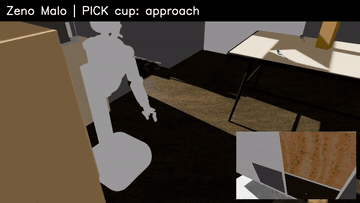<br>[video](media/tasks/breakfast_setup.mp4) | **partial**, progress 67%<br>340 s simulated<br><sub>alternative: mug; dropped: mug</sub> |
| **heat_breakfast_combo** | 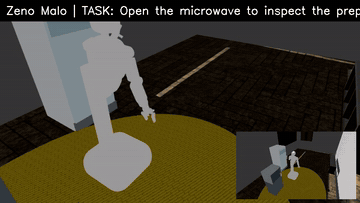<br>[video](media/tasks/heat_breakfast_combo.mp4) | **success**, progress 100%<br>204 s simulated<br><sub>microwave door opened and closed; oatmeal 63.6 °C</sub> |
| **heat_breakfast** | [video](media/tasks/heat_breakfast.mp4)<br>[result JSON](media/tasks/heat_breakfast.result.json) | **success**, progress 100%<br>306.7 s simulated<br><sub>fridge → microwave → table; oatmeal 63.6 °C</sub> |
| **desk_prep** | 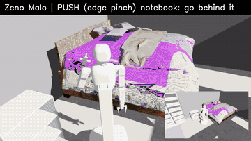<br>[video](media/tasks/desk_prep.mp4) | **success**, progress 100%<br>625 s simulated |
<!-- /TASK_VIDEOS -->

### Breakfast heating (appliance tasks)

`tools/build_appliance_scene.py` adds an articulated refrigerator and a relocated
microwave with a complete four-sided shell, a powered articulated door,
physical door and start buttons, and a low stand. The
appliance layer is `sim/zeno_house_appliances.usd`; the original house is unchanged.

- `heat_breakfast_preloaded` starts with oatmeal in the microwave. The robot
  presses the start button, waits until the food reaches 60 °C, and leaves the
  doors closed. This baseline passed an Isaac Sim run at 100% progress; see
  `runs/heat_breakfast_preloaded_smoke4/result.json`.
- `heat_breakfast_combo` starts with oatmeal already inside the microwave.
  The robot presses the blue door button; the physical hinge opens the door
  for inspection and closes it again. The robot then presses the green start
  button, opens the refrigerator, picks up chilled milk, places it upright on
  the dining table, and closes the refrigerator. The microwave stops when the
  oatmeal reaches the target temperature. The final
  Isaac Sim run passed at 100% progress with oatmeal at 63.6 °C; see
  [recorded result](media/tasks/heat_breakfast_combo.result.json) and the [video](media/tasks/heat_breakfast_combo.mp4).

- `heat_breakfast` transfers the chilled oatmeal from the refrigerator into
  the complete-shell microwave, heats it, retrieves it, and serves it upright
  on the dining table. The seed-0 Isaac Sim rollout passed all four goals at
  **100% progress**: oatmeal reached 63.6 °C, both appliance doors were closed,
  and nothing was dropped. See the [recorded result](media/tasks/heat_breakfast.result.json)
  [video](media/tasks/heat_breakfast.mp4), and
  [task status](tasks/heat_breakfast/STATUS.md). This is one validated
  rollout; different objects, spawn positions, or seeds still need testing.

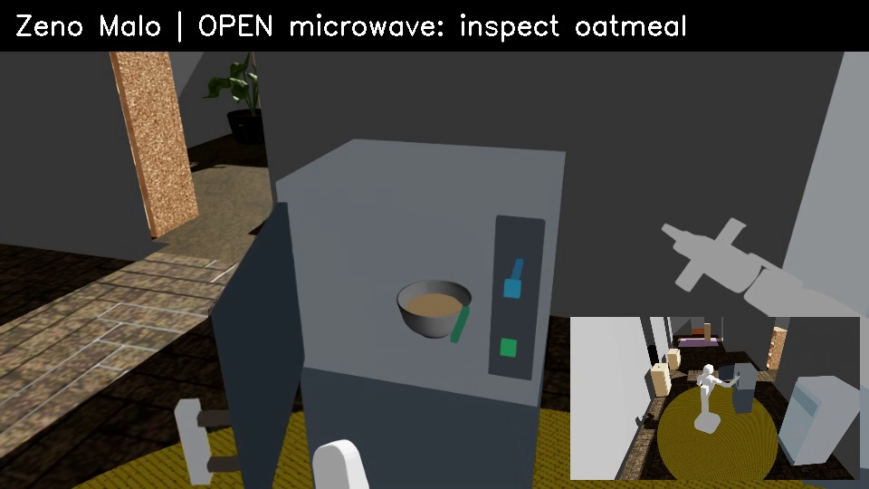<br>
The microwave door at its measured open angle of −1.4 rad (frame from the recorded run).

```bash
$ISAACLAB_PYTHON tools/run_task.py --task heat_breakfast_preloaded --no-video
$ISAACLAB_PYTHON tools/run_task.py --task heat_breakfast_combo  # records runs/heat_breakfast_combo/run.mp4
$ISAACLAB_PYTHON tools/run_task.py --task heat_breakfast --no-video
# Rebuild the appliance layer and tasks:
$ISAACLAB_PYTHON tools/build_appliance_scene.py
$ISAACLAB_PYTHON tools/settle_scene.py sim/zeno_house_appliances.usd
$ISAACLAB_PYTHON tools/annotate_scene.py sim/zeno_house_appliances.usd annotations/zeno_house_appliances.json
bash tools/make_tasks.sh heat_breakfast_preloaded heat_breakfast_combo heat_breakfast
```

Temperature is an explicit task-level state model, not a PhysX heat simulation. It
starts at 4 °C and rises at 4 °C/s only while the microwave is active, its door is
closed, and the oatmeal is inside its annotated cavity. The evaluator checks this
state independently of the policy action log.

### Success conditions

A task succeeds when **every** condition of its goal holds in the final simulator state. `progress` is
the fraction of satisfied items (one item per object slot), so partial solutions are scored.

| Task | Instruction | Goal (all must hold) | Alternatives exercised by the seed |
|---|---|---|---|
| **breakfast_setup** 整理早餐餐具 | Set up the dining table for breakfast. | `plate\|bowl` on the dining table, upright · `cup\|mug` on the dining table, upright · `spoon` on the dining table · one of each within 0.5 m of each other (a place setting) · every door/drawer closed · nothing that started above 10 cm lies on the floor | plate missing (30 %) → bowl; cup missing (30 %) → mug; hint spot occupied by cereal boxes → nearest free spot; plate wider than the gripper → push over the table edge, pinch the overhang |
| **collect_fruits** 收集水果 | Collect the fruits and place them in a container on the low bookcase in the living room. | apple and orange **inside** one container (`fruit_basket\|serving_tray`, bound as `$container`) · `$container` on the bookcase top, upright · all closed · nothing dropped | basket missing (30 %) → tray; a container that keeps rejecting objects → the other one |
| **desk_prep** 准备工作桌 | Prepare the study desk with a notebook, a pen, and a mug. | notebook and `pen\|pencil` on the study desk · `mug\|cup` on the study desk, upright · all closed · nothing dropped | the mug, else the cup (present in 50 % of the variants); pen missing (30 %) or not graspable → pencil; notebook → push + edge pinch |
| **tidy_toys** 收拾玩具 | Collect the toys and store them in the toy box. | toy car, block, duck **inside** one of `toy_box\|storage_basket` · that container upright · all closed · nothing dropped | toy box missing (30 %) → storage basket; toys on the floor → torso fully lowered |
| **shelve_books** 整理书籍 | Collect the books and place them on the bookshelf. | both books on either bookcase (top or a shelf level) · all closed · nothing dropped | a full bookcase top → the other bookcase's top, then shelf levels (the middle shelf is blocked by a duck); books are flat → push over the desk edge, pinch the overhang |

Geometric definitions (`zeno_skills/evaluator.py`):

| condition | JSON | holds when |
|---|---|---|
| `on` | `{"on": [slots], "support": place \| [places], "upright": true}` | object bottom within −2…+5 cm of the surface height and its footprint centre inside the surface's xy box (a spoon resting on a plate still counts); `upright`: tilt ≤ 20° |
| `inside` | `{"inside": [slots], "container": "a\|b", "bind": "name"}` | object centre inside the container's wall profile, between its floor and 3 cm above the rim; **one** container holds every slot; it is bound for later conditions (`"$name"`) |
| `upright` | `{"upright": [slots], "max_tilt_deg": 20}` | tilt of the object's z axis ≤ limit |
| `near` | `{"near": [slots], "support": place, "max_dist": 0.5}` | one instance per slot on that support, pairwise within `max_dist` |
| `heated` | `{"heated": [slots], "appliance": name, "min_temp_c": 60}` | measured task temperature meets the threshold |
| `closed` | `{"closed": "all" \| [names], "tol": …}` | every listed articulated joint within 0.10 rad (doors) / 4 cm (drawers) of closed |
| `not_dropped` | `{"not_dropped": "all"}` | no object that started above 10 cm is on the floor (unless inside a container) |

Slots: `"apple"` = that instance, or any instance of the role `apple`; `"plate|bowl"` = the first present
alternative, in order; `"all:fruit"` = one slot per instance of the role; `"$container"` = the instance
bound by an earlier condition.

### Run a task

```bash
export OMNI_KIT_ACCEPT_EULA=YES
$ISAACLAB_PYTHON tools/run_task.py --task collect_fruits                  # policy + video -> runs/collect_fruits/
$ISAACLAB_PYTHON tools/run_task.py --task collect_fruits --evaluate-only  # only score the current state
$ISAACLAB_PYTHON tools/build_tasks.py --task collect_fruits --seed 3      # a new random variant
```

`result.json` holds the initial and final evaluation (per condition and per slot, with the reason
for every failure), every policy decision (`alternative`, `pick_failed`, `dropped`, `container_swapped`,
…) and every skill event. Exit code 0 = success, 3 = failed, 4 = crash.

To evaluate your own policy, build the scene, run your controller, and call

```python
from zeno_skills.evaluator import TaskEvaluator, rig_state
ev = TaskEvaluator(json.load(open("tasks/collect_fruits/task.json")), rig.ann)
rep = ev.evaluate(rig_state(rig))       # or any {"objects": {name: {pos, quat}}, "joints": {name: q}}
rep["success"], rep["progress"], rep["conditions"]
```

### Define your own task

See [新建任务、资产、场景和标注](docs/README.md) for the spec, build, settle, check, annotate, and run workflow. The runnable starting point is [`task_specs/examples/serve_guest.json`](task_specs/examples/serve_guest.json).

## GT annotations (IK + grasp + RL)

**Every object in every scene has an asset annotation, and every articulated part has a handle
frame.** These supply core geometry for scripted IK and grasp planning, and can serve as
privileged observations and dense rewards for RL. Appliance actions also use specialized control.

<p align="center">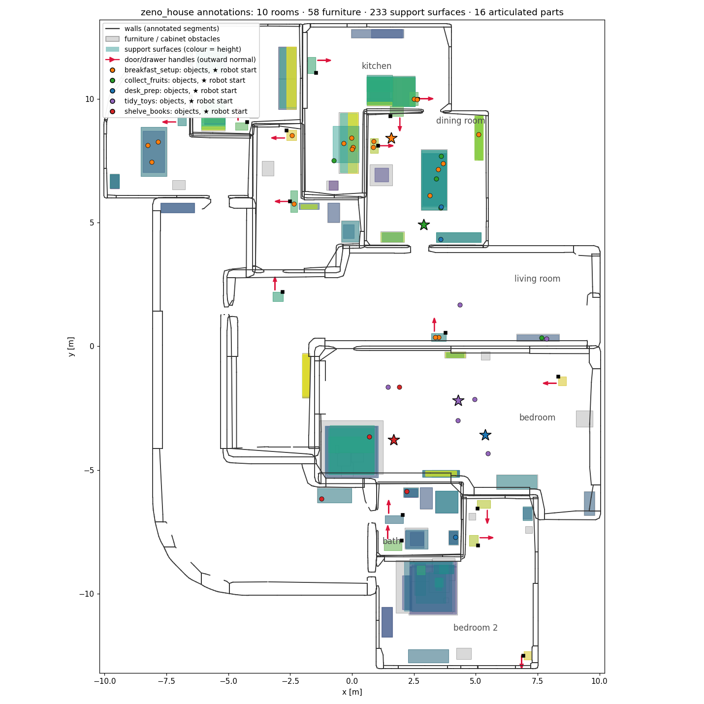</p>

`annotations/assets.json` holds one entry per asset type, in the object frame:
- size, mass, tags (e.g. `fruit`, `container`, `book`)
- the origin → bottom-centre offset
- the container wall profile (rim radius and height)
- grasp primitives for the Zeno 8 cm pinch gripper:
  - `rim_pinch` / `rim_pinch_rect`: containers. Pinch the wall at the rim; candidates over rim
    azimuth × approach tilt.
  - `top_pinch`: vertical approach across the narrowest cross-section. The cross-section is found
    by sliding a pad-wide slab along the object, so pens, spoons and toy cars work; `offset_xy`
    gives the pinch point.
  - `edge_pinch_after_push`: flat objects wider than the gripper (plate, books, notebook).
  - Not graspable by Zeno: cereal box (wider than the gripper in every direction). The teddy bear only has a
    crown pinch on its head (`"crown": true`), which does not survive a carry.

<p align="center">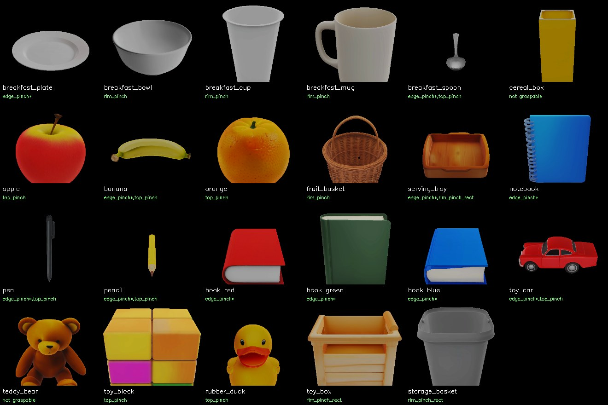</p>

`annotations/<scene>.json` and `tasks/*/annotation.json` are per scene, in the world frame:

| key | content |
|---|---|
| `rooms` | floor triangles (point-in-room queries) |
| `obstacles` | 58 furniture AABBs, cabinet bodies, 1874 wall segments |
| `supports` | 233 horizontal surfaces (table tops, desk tops, every shelf level): height, extent, vertical clearance |
| `articulated` | 16 doors/drawers: joint path, type, pivot, axis, limits, open/closed value, moving-part boxes, handle frame (centre, outward normal, along-face direction, bar size) |
| `objects` | prim, rigid-body path, asset type, pose, AABB, room, supporting surface |

Python helpers (`zeno_skills/annotations.py`):

```python
ann = SceneAnnotations("tasks/collect_fruits/annotation.json")
ann.grasp_poses(ann.objects["orange"], pos, quat)          # world TCP grasp candidates
ann.handle_pose(ann.art("KitchenCabinetFactory_7025538_spawn_asset_6631478"), q)  # handle TCP pose at joint value q
ann.motion(art, q)                                         # rigid motion of the door/drawer
```

---

## Atomic skills

<!-- SKILL_VIDEOS -->
| | |
|---|---|
| 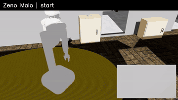<br><sub>Open + close a cabinet door (revolute): side-hook grasp, base rides with the door ([mp4](media/skills/open_close_door.mp4))</sub> | 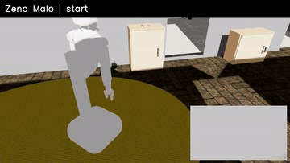<br><sub>Open + close a drawer (prismatic) ([mp4](media/skills/open_close_drawer.mp4))</sub> |
| 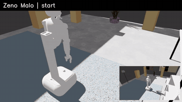<br><sub>Pick a pencil from the study desk, carry it through two rooms, place it on the bedroom desk ([mp4](media/skills/pick_place_table.mp4))</sub> | 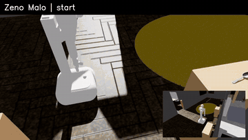<br><sub>Pick an orange, drop it into the fruit basket ([mp4](media/skills/place_in_container.mp4))</sub> |
| 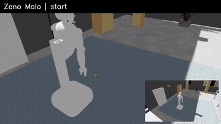<br><sub>Floor pick (torso fully lowered) into the storage basket ([mp4](media/skills/floor_pick.mp4))</sub> | 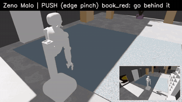<br><sub>Flat book: push it over the desk edge, pinch the overhang, place it on a bookcase and push it on ([mp4](media/skills/flat_pick_place.mp4))</sub> |
<!-- /SKILL_VIDEOS -->

Run any sequence of skills on any scene (records `run.mp4` + `result.json`):

```bash
$ISAACLAB_PYTHON tools/run_skills.py --scene tasks/collect_fruits/scene.usd \
    --ann tasks/collect_fruits/annotation.json --out runs/demo \
    --plan "pick orange" "place orange in:fruit_basket" \
           "open KitchenCabinetFactory_7025538_spawn_asset_6631478" "close KitchenCabinetFactory_7025538_spawn_asset_6631478"
# steps: open <art> | close <art> | pick <obj> | place <obj> in:<container>
#        place <obj> <surface or alias> [x y] | push <obj> <dx> <dy> | goto <x> <y> <yaw>
```

## Skill / Contract / Policy public IDs

The [Skill Library](skill_library/README.md) provides 22 task-level Skill records.
The [Contract Library](contract_library/README.md) provides 8 measured execution
interfaces, and the [Policy Library](policy_library/README.md) records all 60
low-level controllers. Public IDs use skill_XXX, contract_XXX, and policy_XXX;
[the mapping](docs/INTERFACE_IDS.md) lists every legacy alias. Existing scripts
and Python policy class names remain callable.

## Atomic GT policy class API

`zeno_skills/policies/` exposes target-parameterized `AtomicPolicy.execute(...)` classes bound to one live `Rig` through `PolicySuite(rig)`. A policy is atomic at the skill-graph boundary: its internal controller may approach, grasp, lift, and check the result. Asset-specific contact points live in `annotations/assets.json`. `TaskPolicy` currently composes `PolicySuite` calls directly; a general skill-subgraph planner is not implemented.

The [capability catalog](docs/POLICY_CATALOG.md) has **60 OOP entries**: **54** passed at least one stated Isaac Sim scene and **6** remain callable without a successful object-level check. See the [verification record](docs/POLICY_VERIFICATION.md) before choosing a route for a new object or scene. General dispatchers and convenience composites are counted separately.

| Interface | Representative calls |
|---|---|
| General | `policy.navigate.execute((x, y, yaw_deg))`, `policy.pick.execute("cup")`, `policy.place.on("cup", support)`, `policy.open.execute(door)`, `policy.close.execute(door)` |
| Object-specific grasp | `policy.pick_top.execute("toy_block")`, `policy.pick_round_rim.execute("cup")`, `policy.pick_cup_handle.execute("mug")`, `policy.pick_edge.execute("book_red")` |
| Motion and posture | `policy.right_tcp_move.execute(position, rotation)`, `policy.right_gripper_open.execute(0.04)`, `policy.lower_torso.execute()`, `policy.pick_while_moving.execute(...)` |
| Appliance stages | `policy.microwave_button_press.execute(...)`, `policy.microwave_cavity_insert.execute(...)`, `policy.open_powered.execute("kitchen_microwave")` |

`pick_cup_handle` needs a physical handle collider: `tools/run_skills.py` and `tools/run_contracts.py` add it for a requested mug route; direct Python setup uses `make_rig(..., handle_objects=("mug",))`. `pick_from_cavity` has only been verified when the same rig just placed the cup inside. The six unverified floor and dual-arm routes are listed in the catalog and should not be assumed to work in new tasks.

### Compose through contracts

Eight [contract interfaces](docs/CONTRACT_PROPOSAL.md) map semantic calls such as `pick.v1` to concrete policy routes. `ContractSpec.bind()` creates a policy instance; `ContractRunner.run()` executes the chosen route, checks common measured pre/postconditions, and records success or failure. It does not select routes or replan after failure. A verified four-step plan is [contract_microwave_cycle.json](tests/fixtures/contract_microwave_cycle.json):

```bash
OMNI_KIT_ACCEPT_EULA=YES ${ISAACLAB_PYTHON:-python} tools/run_contracts.py \
  --scene runs/verify_microwave_fixture/task/scene.usd \
  --ann runs/verify_microwave_fixture/task/annotation.json \
  --plan tests/fixtures/contract_microwave_cycle.json \
  --out runs/my_contract_cycle
```

Build the scene with the commands in the [verification record](docs/POLICY_VERIFICATION.md). The sequence passed `open.v1/powered → pick.v1/round_rim → place.v1/microwave → pick.v1/cavity` on one rig. Direct Python use is `ContractRunner(rig).run("pick.v1", "round_rim", "cup")`. Failed calls raise `SkillFailure` or `Dropped`; the caller should read the changed simulator state before trying another route. Final task success is scored by `TaskEvaluator`.

For a manual policy sequence, use `tools/run_skills.py --plan "pick_round_rim cup" "place_microwave cup"` with a scene and annotation. All route names, scopes, and evidence are in the catalog; `pick_and_carry` and `microwave_door_cycle` are convenience compositions rather than additional atomic entries.

### Malo first-person RGB camera

Malo has a camera mounted on `stereo_camera_link`. Enable it when launching and building the rig, then capture the current view on demand:

```python
from zeno_skills.runtime import launch, make_rig

app = launch(video=False, first_person=True)
rig = make_rig(app, "tasks/tidy_toys/scene.usd", "tasks/tidy_toys/annotation.json",
               video=False, first_person=True)
rig.step(30)  # let the scene initialize
rgb = rig.get_first_person_image()  # NumPy uint8 array, (480, 640, 3)
# imageio.v2.imwrite("runs/malo_first_person.png", rgb)
app.close()
```

The camera follows Malo's head. `get_first_person_image()` renders the latest state without advancing physics; `first_person_res=(height, width)` changes the resolution. The camera can be enabled with or without third-person video.

## Skills

`zeno_skills/skills.py` uses annotated geometry and simulator feedback. Appliance actions
also use specialized control and scene-specific parking hints. Each skill measures its own
outcome from simulator state and raises `SkillFailure` on failure, so a policy can react.
Standard pinch picks, mug-handle picks, and surface/container placements now ease
into and out of contact along the same planned arm path; their gripper targets close
and release gradually. The contact-sensitive book edge route retains its original timing.
Object-specific grasp annotations and measured success checks still apply.

| skill | how |
|---|---|
| `navigate` | Tuck the arm (or lift and pull in the held object), A* over free base cells, drive the holonomic base; slower while carrying, and the object is checked to still be in the hand afterwards (`Dropped` → the task policy picks it up again) |
| `open_articulated` / `close_articulated` | Search base poses where pre-grasp → grasp is a continuous collision-free IK path *and* the robot can ride rigidly with the door or drawer to its goal; prefer the lowest wrist torque. Side-hook grasp: one finger sits between the panel and the bar. Closed loop on the measured joint value. Doors (revolute) and drawers (prismatic) |
| `pick` (pinch) | Grasp candidates at the object's current pose (`top_pinch`, `rim_pinch`), a base pose per candidate, approach → close → lift; floor objects with the torso fully lowered |
| `push` | Fingers closed and pointing down, pads just above the surface, slide the object along it; if nothing reaches behind the object, press on its top and drag it |
| `pick` (flat) | Plates, books, notebooks are wider than the 8 cm gripper: push them until they overhang a free support edge (centre of mass kept 5 cm inside), then pinch the overhang horizontally. On the floor: a diagonal corner pinch (side face + top face) |
| `place` | Keep the measured TCP→object offset, search the object's yaw and a base pose, lower, release; into containers from just above the rim. Edge-held flat objects are slid back over the edge of the target surface |
| `press_microwave_start` | Physically press the annotated start button after checking that the door is closed and food is in the cavity; activate the task-level thermal model |
| `open_microwave_door` / `close_microwave_door` | Separate powered-door actions; opening physically presses the annotated blue button, and both check the measured hinge angle |
| `cycle_microwave_door` | Composite demonstration that calls the separate microwave open and close actions |

Kinematics are exact URDF FK plus analytic-Jacobian damped least-squares IK on the fingertip TCP.
Collision uses a sphere model of the robot against the annotation boxes and each moving part at its
current joint value.

## Physics fixes baked into the scene

Each fix removes a bug found in the URDF→USD import. The code is in `zeno_skills/physics.py`.

| problem as imported | fix |
|---|---|
| All robot drives had damping 0 | Damped position drives; joint targets time-scaled to 60 % of URDF velocity limits (torso lift is 0.117 m/s) |
| Floating base on 2 N·m wheel drives: the base moved instead of the door | Base anchor joint, moved kinematically (holonomic) |
| Finger colliders (convex decomposition) fused pad and rail into a wedge, so the fingers stalled 3.4 cm open | Pad-sized box colliders, rubber friction (μ 2.0, combine = max) |
| Left arm hung into the floor when the torso lowered | Held folded |
| Containers were imported as one convex hull (a solid dome) | Walls following the mesh profile plus a base plate |
| Placeholder inertia (1, 1, 1) kg·m² | Box inertia from real size and mass |
| Rigid body nested under a rigid body (`collisions` prim) | Stripped |
| Collision API on Xforms, uneven bottoms: boxes rocked, spoons fell through | Convex hull on the collision mesh |
| Hinges with no damping; joint friction made doors un-openable | Viscous damping only on hinges; small friction on drawers |
| Objects spawned floating or interpenetrating | Drop-and-settle, rest poses written back |
| Every generated asset shared one texture file (`material_0.png`) | Per-asset textures (`tools/fix_textures.py`) |

---

## Quick start

Requirements: Isaac Sim 5.1 + Isaac Lab 2.3 (tested). For regenerating assets only: an
[EmbodiedGen](https://github.com/HorizonRobotics/EmbodiedGen) checkout (`EMBODIEDGEN_ROOT`).

```bash
git lfs install && git clone <this repo> zeno-house && cd zeno-house
export OMNI_KIT_ACCEPT_EULA=YES ISAACLAB_PYTHON=/path/to/isaaclab/python

# physics check + preview renders of a task scene
$ISAACLAB_PYTHON tools/check_scene.py tasks/collect_fruits/scene.usd --out runs/check \
    --view table 4.4 6.0 1.7 3.5 7.1 0.85

# a whole task: evaluate -> scripted policy -> evaluate (runs/collect_fruits/{run.mp4,result.json})
$ISAACLAB_PYTHON tools/run_task.py --task collect_fruits

# single skills (see "Atomic skills")
$ISAACLAB_PYTHON tools/run_skills.py --scene tasks/collect_fruits/scene.usd \
    --ann tasks/collect_fruits/annotation.json --out runs/demo --plan "pick orange" "place orange in:fruit_basket"

python -m pytest tests/        # evaluator + task-spec tests (no simulator needed)
```


## Add your own assets (EmbodiedGen V2)

See the [creation README](docs/README.md#2-新增可抓取资产) for generation, USD conversion, shared grasp annotations, and task integration.

## Rebuild pipeline

The [creation README](docs/README.md) gives the task, scene, annotation, and PartNet commands in execution order.

## Repository layout

```text
sim/zeno_house.usd      final house scene (+ sim/checks)
task_specs/             task definitions (+ places.json aliases, examples/)
tasks/<task>/           built task: layer, task.json, annotation.json, check renders
annotations/            assets.json, zeno_house.json, house_static.json
zeno_skills/            kinematics, collision, annotations, planner, rig, skills, physics,
                        policies/ (atomic GT policy classes), tasks (spec loading),
                        evaluator (success check), task_policy, runtime
tests/                  evaluator and spec tests (pytest, no simulator)
tools/                  pipeline scripts
usd/                    house, robot and asset USDs (+ materials/textures)
assets/asset3d/         EmbodiedGen V2 asset sources (URDF + textured OBJ)
robot_sources/          Zeno Malo URDF + meshes
media/                  README media, demo videos, rollout result.json files
```

## Limitations

- The scripted policy is a baseline, not an oracle. Known weak spots, all visible in the task videos
  and `result.json` decisions:
  - **breakfast_setup** is solved only partially (67 % in the recorded run): the plate and spoon start on
    the dining table and are regrouped fine, but the rim pinch on the light cup and on the mug missed
    twice each, so the `cup|mug` slot and the place setting stay open. Plates (pinched at the rim
    after a push) and bowls held by the rim can also pivot out of the 8 cm pinch during long carries;
    the policy detects the drop and re-picks, and after two failures takes the alternative object.
  - **Thin pens** (1 cm) are sometimes missed by the top pinch; desk_prep then takes the pencil.
  - **Flat objects** are placed over a free edge of the target surface and then pushed fully onto
    it. Interior shelf levels (28 cm headroom) are not reachable with a book in the hand, so books
    go to bookcase tops.
  - The **banana** (curved, pinched off its centre of mass) and the **teddy bear** (plush, crown pinch)
    are annotated but were taken out of the task specs: their grasps do not survive a carry.
- Kinematic holonomic base (anchor joint): no wheel dynamics. Base motion uses one smooth
  time scaling per path (≤ 0.35 m/s, ramps of 0.8 s).
- Robot links are gravity-compensated, like the real arm controller.
- Generated asset sizes and masses come from a spec table in `tools/prepare_assets.py` (plus
  `assets/custom_assets.json`). EmbodiedGen's LLM sizing needs an API key that was not available.
- Reachability in the task builder is a top-down pinch check with the planner; it does not
  guarantee that the physical grasp succeeds.

## Acknowledgements

House layout: [Infinigen](https://github.com/princeton-vl/infinigen) (BSD-3). Assets:
[EmbodiedGen](https://github.com/HorizonRobotics/EmbodiedGen) V2 (Apache-2.0). Robot:
Zeno Malo EDU description (see `robot_sources/zeno_malo_description-master/LICENSE`).
