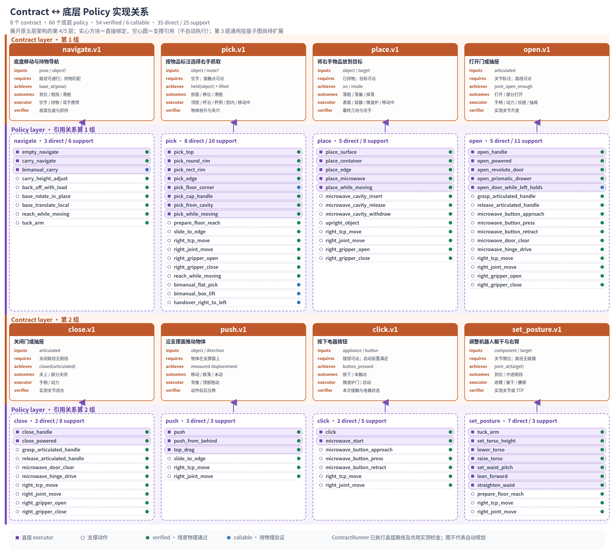

# Zeno House contract 接口与扩展提案

八个 [ContractSpec](../zeno_skills/contracts.py) 定义语义接口与底层 policy 路由。[ContractRunner](../zeno_skills/contract_runtime.py) 现可按顺序执行指定路线，检查共用前置条件与动作后的实测状态，并留下成功或失败记录；[run_contracts.py](../tools/run_contracts.py) 接受 JSON 调用序列。`TaskPolicy` 仍负责已有任务目标的自动动作选择；技能子图规划器和自动路线选择尚未实现。新增目标谓词或物理机制需要研究者扩展评估器或控制器。

## Contract 与 policy 的两层关系（8 × 60）



[打开高清 PNG](contract_layers_preview.png) · [SVG 原图](contract_layers.svg)

图从当前 [60 项 policy 能力目录](POLICY_CATALOG.md) 和 [ContractSpec 注册表](../zeno_skills/contracts.py) 生成，覆盖全部 **60 个不同的独立 policy**：其中 **35 个**是至少一个 contract 的直接 `executor`，其余 **25 个**目前只作为支撑动作引用。同一 policy 可在多个 contract 下重复出现。实心方块是 `ContractSpec.executor` 可通过 `bind()` 选择的直接类绑定；空心圆是该 contract 使用或准备时可能需要的支撑动作引用，**不会由 `bind()` 自动执行**。绿色表示对应动作已有 Isaac Sim 成功记录，蓝色表示有独立入口但待物理验证。图表示静态关系；`ContractRunner` 可执行直接绑定并检查共用的实测前后状态，技能子图规划器仍未实现。

## 抽象边界

一个 contract 描述**一次动作要达到的语义结果**，同一 contract 可选择多个具体底层 policy。例如 `pick.v1` 可根据物体抓取标注选择 `pick_top`、`pick_round_rim`、`pick_rect_rim`、`pick_edge` 或 `pick_floor_corner`。杯子与玩具的接触点不同，输入 `object` 和资产标注决定实际抓法；无需为每件物品另建 contract。`open.v1` 同理可选手柄路线或微波炉按钮加铰链路线。contract 与 policy 是多对多关系：一个 policy 路线也可能为多个 contract 提供低层阶段。

`ContractSpec.bind(rig, route=...)` 返回 policy 实例；`ContractRunner.run(contract_id, route, *args, **kwargs)` 调用它并核对实测结果。不同路线可能需要额外的 `execute()` 参数。例如移动中抓取需要 `base_path`，双手携带需要物体名和底盘目标。双臂抓取、换手和物体扶正目前作为相关 contract 的**支撑引用**展示，尚不是八个 contract 的直接 executor 路线。

`id` 中的 `.v1` 是**语义接口版本**，不是模型版本，也不是某次训练的权重。`inputs` 绑定实例、目标和阈值；`requires` 是运行前的状态条件；`achieves` 是成功后应成立的状态谓词；`outcomes` 记录成功、失败和物理副作用；`executor` 指向实际 policy；`verifier` 必须读取调用后的仿真状态或本次动作产生的证据，不能只相信 `execute()` 返回 `True`。下面的 `existing` 说明底层已有检查，`to_add` 列出领域级或更严格的验证扩展；runner 已实现八类 contract 的共用实测检查。物理动作失败后可能已改变物体或门的位置，重新规划前应重新读取状态。

| Contract | 主要语义 | 可选底层路线 |
|---|---|---|
| `navigate.v1` | 到达目标底盘位姿 | `empty_navigate`、`carry_navigate`、`bimanual_carry`、`navigate` |
| `pick.v1` | 用右手抓住指定物体 | top、round rim、rect rim、edge、floor corner、cup handle、cavity、moving |
| `place.v1` | 把所持物体放到指定目标 | surface、container、edge、microwave、moving |
| `open.v1` | 打开一扇门或抽屉 | handle、powered microwave、revolute、prismatic、while left holds |
| `close.v1` | 关闭一扇门或抽屉 | handle、powered microwave |
| `push.v1` | 沿支撑面推动物体 | behind push、top drag |
| `click.v1` | 按下一个按钮 | microwave door、microwave start |
| `set_posture.v1` | 到达指定躯干/右臂姿态 | tuck arm、torso lift、waist pitch |

## 可运行的 contract 串接

下面的计划在 Isaac Sim 中依次完成开门、杯沿抓取、放入微波炉、从炉腔取出；每一步都通过 contract 的关节、抓持或几何后置检查。记录：`runs/final_contract_microwave/result.json`（`runs/` 默认不纳入 Git）。复现用的场景定义见 [policy_microwave_cup.json](../tests/fixtures/policy_microwave_cup.json)。

```bash
OMNI_KIT_ACCEPT_EULA=YES ${ISAACLAB_PYTHON:-python} tools/run_contracts.py \
  --scene runs/verify_microwave_fixture/task/scene.usd \
  --ann runs/verify_microwave_fixture/task/annotation.json \
  --plan tests/fixtures/contract_microwave_cycle.json \
  --out runs/my_contract_cycle
```

[计划 JSON](../tests/fixtures/contract_microwave_cycle.json) 中每项指定 `contract`、`route`、`args` 和可选的 `kwargs`。上层程序也可在一个 `rig` 上调用 `ContractRunner(rig).run("pick.v1", "round_rim", "cup")`。失败会抛出异常并保留已发生的物理状态，调用方应重新观察后决定后续路线。`requires`、`achieves` 中的完整领域谓词仍是下述设计接口；当前 runner 实现的是八类 contract 的共用检查，不执行 YAML 中的全部概念谓词，也不会自动执行图上的支撑 policy。

## Contract 定义

以下 YAML 是**建议的数据结构**，不应直接当作已可加载的配置文件。谓词名如 `held(object)` 是概念表示；落地时须明确它们如何读 `Rig`/`Geometry`/`TaskEvaluator`。

### 1. `navigate.v1`

```yaml
id: navigate.v1
description: 把 Zeno 的底盘移动到目标位姿；若正在持物，则在移动后保持该抓取。
inputs:
  robot: zeno
  pose: [x_m, y_m, yaw_deg]
  carried_object: 可选；指定时必须是当前所持物体
  min_bottom_z_m: 可选；持物时的最低离地高度
requires:
  - 目标位姿属于可导航区域，地图和底盘碰撞信息可用
  - carried_object 为空时当前未持物；否则当前正持有该物体
achieves:
  - base_at(pose, xy_tolerance_m, yaw_tolerance_deg)
  - carried_object 非空时 held(carried_object)
outcomes:
  success: 到位并保住抓取（如有）
  failure: 无路径、碰撞阻塞、到位误差超限或物体滑脱；底盘可能停在途中
executor:
  select: 未持物 -> PolicySuite.empty_navigate；右手持物 -> PolicySuite.carry_navigate；双手持物 -> PolicySuite.bimanual_carry
  fallback: PolicySuite.navigate 根据实时持物状态分发
verifier:
  existing: 右手持物路线调用 check_held；双手携带调用 check_bimanual_hold
  runner: 已读取最终 base_pose，以 XY 误差 <= 0.05 m、偏航误差 <= 5° 检查；任务可标定更严格阈值
```

### 2. `pick.v1`

```yaml
id: pick.v1
description: 对指定物体完成一次右手抓取、抬起和抓取保持检查。
inputs:
  robot: zeno
  object: 场景标注中的物体实例名
  grasp_route: auto | top | round_rim | rect_rim | edge | floor_corner | cup_handle | cavity | moving
  base_path: 可选；moving 路线必需
  cavity: 可选；cavity 路线指定腔体
requires:
  - 右手未持物，物体存在并有对应抓取标注
  - 目标可接近；若在关闭的门或抽屉内，先执行 open 并确认可达
  - edge 路线要求物体在已标注支撑面上；floor_corner 要求物体在地面附近
achieves:
  - held(object)
  - 物体已离开原支撑面，且抓取相对位置稳定
outcomes:
  success: 建立右手抓取，可继续 carry_navigate 或 place
  failure: 无可达抓取、闭合不足、未抬起或滑脱；edge 路线失败后物体也可能已被推过
executor:
  select: auto -> PolicySuite.pick；显式路线还包括 pick_cup_handle / pick_from_cavity / pick_while_moving
  grounding: 根据物体几何标注选接触点；例如玩具顶捏、杯沿夹取、书本推到桌边后夹取
verifier:
  existing: 各 pick 路线检查夹爪、抬起和 held 记录；后续持物动作可调用 check_held
  runner: 已复核 rig.held 的实例名、本次抬升量和双指间距；抓取类型可作为路线元数据补充
```

### 3. `place.v1`

```yaml
id: place.v1
description: 把右手所持物体释放到一个明确的支撑面或容器，并确认它已落稳。
inputs:
  robot: zeno
  object: 当前所持物体实例名
  target: 支撑面名，或 in:<container>；微波炉使用其 inside_floor 支撑面
  hint_xy_m: 可选的放置位置提示
  base_path: 可选；moving 路线必需
requires:
  - 当前持有 object，目标有可用几何标注和放置空间
  - 若目标在微波炉腔内，门已打开且进入路径可达
achieves:
  - 支撑面目标 -> on(object, target)
  - 容器目标 -> inside(object, container)
  - 右手不再持有 object
outcomes:
  success: 物体落在目标上或内部，机械手已退出
  failure: 路径阻塞、释放后滚落或目标状态不成立；物体可能已离手并停在别处
executor:
  select: PolicySuite.place 或显式 place_surface / place_container / place_edge / place_microwave / place_while_moving
  stages: microwave 路线复用 cavity_insert -> cavity_release -> cavity_withdraw
verifier:
  existing: 放置路线有几何落点检查；微波炉路线检查腔内支撑与姿态
  runner: 已调用 Geometry.on / Geometry.inside 并核对 held 已清空；更长稳定时间可按任务补充
```

### 4. `open.v1`

```yaml
id: open.v1
description: 将一个已标注的门或抽屉打开到本次任务所需的开度。
inputs:
  robot: zeno
  articulated: 门或抽屉实例名
  required_access_to: 可选；后续要取放的物体实例名
  left_held_object: 可选；while_left_holds 路线必需
requires:
  - 存在铰链/滑轨和开闭位置标注
  - 手柄路线可接近且右手空闲；微波炉开门路线可按到 door 按钮并避开门扫掠区
achieves:
  - joint_open_enough(articulated)
  - 若填写 required_access_to，则 accessible(required_access_to)
outcomes:
  success: 门/抽屉达到所要求开度
  failure: 按钮、手柄、运动路径或关节行程失败；门可能部分打开
executor:
  select: PolicySuite.open；手柄 -> open_handle；微波炉 -> open_powered；也可显式选 open_revolute_door / open_prismatic_drawer / open_door_while_left_holds
  stages: 微波炉路线复用 door button 按压、door_clear、hinge_drive
verifier:
  existing: 底层路线读取关节值；按钮阶段检查 TCP 到按钮的误差
  runner: 已核对实测关节开度；若指定物体可达，还须扩展遮挡/可达性检查
```

**开度细节：** 当前抽屉 `open` 路线允许相对较大的行程误差，而 `TaskPolicy` 判断“物体不再被关在里面”使用更严格的开度条件。因此 `open.execute()` 成功不能直接等价于 `accessible(object)`；只有第二个条件也通过时，才能把后续 `pick` 接上。

### 5. `close.v1`

```yaml
id: close.v1
description: 将一个已标注的门或抽屉关到其 closed_q 状态。
inputs:
  robot: zeno
  articulated: 门或抽屉实例名
requires:
  - 存在关闭位置标注，门的运动空间可用
  - 手柄路线要求右手可用；微波炉 powered 路线需先避开门扫掠区
achieves:
  - closed(articulated)
outcomes:
  success: 门/抽屉闭合
  failure: 阻挡、路径失败或关节未到位；门可能部分关闭，腔内物体可能被扰动
executor:
  select: PolicySuite.close；手柄 -> close_handle；微波炉 -> close_powered
  detail: 微波炉关闭由 door_clear 和 hinge_drive 组成；持物时须检查所持物未滑脱
verifier:
  existing: 底层读取关节值；TaskEvaluator 已有 closed 谓词
  runner: 已核对实测关节到 closed_q 的误差；任务可继续检查持物状态和遮挡
```

### 6. `push.v1`

```yaml
id: push.v1
description: 在当前支撑面上沿指定方向推动或拖动物体，达到最小可测位移。
inputs:
  robot: zeno
  object: 被接触的物体实例名
  support: 当前支撑面标注
  direction_xy: 水平单位向量 [dx, dy]
  distance_m: 期望行程，正数
  min_progress_m: 合同接受的最小投影位移
requires:
  - 右手未持物，物体在所给支撑面上且接触路径可达
  - 方向已归一化，distance_m > 0
achieves:
  - displacement_along(object, direction_xy) >= min_progress_m
  - 若任务要求保留支撑，仍有 on(object, support)
outcomes:
  success: 测得足够的方向位移
  failure: 接触不到或位移不足；物体可能已经移动、旋转或掉落
executor:
  select: PolicySuite.push 自动选择；也可显式 push_from_behind 或 top_drag
verifier:
  existing: 底层测量物体位移并检查动作阶段的最小进度
  runner: 已保存前后物体位姿并按 direction_xy 投影；任务可补充 on(object, support)
```

### 7. `click.v1`

```yaml
id: click.v1
description: 按下一个已标注的按钮；只承诺本次按钮动作的可观测效果。
inputs:
  robot: zeno
  appliance: 电器实例名；当前实现为 kitchen_microwave
  button: door | start
requires:
  - 右手未持物，按钮有位置标注且可达
  - start 还要求微波炉门已关闭、腔内有任务食品且热模型可用
achieves:
  - door -> button_pressed_this_call(appliance, door)
  - start -> button_pressed_this_call(appliance, start) 且 heating_active(appliance)
outcomes:
  success: 完成按钮按压；start 使任务热模型进入加热状态
  failure: 未到达按钮或启动前提不满足；按压与撤离过程可能只完成一部分
executor:
  select: PolicySuite.click.execute(appliance, button=button)
  aliases: PolicySuite.microwave_start 是 start 按钮的现有专用入口
  stages: microwave_button_approach -> microwave_button_press -> microwave_button_retract
verifier:
  existing: 按压阶段检查 TCP 到按钮的误差；start 路线还设置并记录 thermal.active
  runner: 已只读取本次调用之后的按钮事件；start 同时核对 thermal.active
```

`click(door)` **不会自动打开门**；`open(microwave)` 才包含按钮与铰链动作。`click(start)` 的结果是 `heating_active`，**不是** `heated(food, target_temp)`。现有加热等待与温度复核在 `TaskPolicy._fix_heated`。若未来要求技能图里“等待加热至目标温度”也必须是 contract 节点，就应增加第九个 `wait_until_heated`（或 `heat_until`）contract；不应把它塞进 `click`。

### 8. `set_posture.v1`

```yaml
id: set_posture.v1
description: 将 Zeno 的右臂、躯干升降或腰部俯仰设为指定姿态。
inputs:
  robot: zeno
  component: right_arm_tuck | torso_lift | waist_pitch
  target: tuck 时省略；torso_lift 为关节高度 m，waist_pitch 为角度 rad
requires:
  - 右手未持物，目标在对应关节限位内，有无碰撞运动路径
achieves:
  - right_arm_tuck -> arm_tucked()
  - torso_lift 或 waist_pitch -> joint_at(component, target, tolerance)
outcomes:
  success: 指定姿态关节到位，可作为低处抓取、通行等后续动作前提
  failure: 限位越界、无安全路径或实测误差过大；机械臂可能停在中间姿态
executor:
  select: tuck_arm；set_torso_height / lower_torso / raise_torso；set_waist_pitch / lean_forward / straighten_waist
  detail: torso 与 waist 直接路径阻塞时，现有代码先尝试 tuck_arm 再规划
verifier:
  existing: tuck 检查关节向量误差；torso 容差 0.02 m，waist 容差 0.035 rad
  runner: 已核对目标关节误差；任务可补充姿态谓词与环境可达性
```

## 简洁的 Python 表示与 policy 引用

真实的八字段定义在 [`zeno_skills/contracts.py`](../zeno_skills/contracts.py)。`executor` 直接保存已有 `AtomicPolicy` 子类；`bind()` 只选择并实例化路线。`ContractRunner` 实现八类共用的实测前后检查，完整领域谓词仍由上层补充。例如杯子使用圆形杯沿路线：

```python
from zeno_skills.contracts import CONTRACTS
from zeno_skills import skills

pick = CONTRACTS["pick.v1"]
assert rig.held is None                    # requires: right hand empty
policy = pick.bind(rig, route="round_rim") # RoundRimPickPolicy(rig)
policy.execute("cup")                     # existing atomic policy
assert rig.held and rig.held["name"] == "cup"
skills.check_held(rig, "pick_contract")   # example post-action check
```

若输入是带 `top_pinch` 标注的玩具，改用 `route="top"`；自动路线用 `route="auto"`。实际工程运行可直接使用 `ContractRunner(rig).run("pick.v1", "round_rim", "cup")`；当前 runner 实现通用的抓持、抬升和其他七类结果检查，任务特有谓词由上层补充。

## 如何组合成新任务

例如把冰箱里的食品放进微波炉加热，图节点可引用同一批 contract：

```text
open(fridge, required_access_to=food)
  -> pick(food)
  -> open(microwave)
  -> place(food, microwave/inside_floor)
  -> close(microwave)
  -> click(microwave, start)
  -> 等待并验证 heated(food, target_temp) [当前由 TaskPolicy 协调，不在 8 个 contract 内]
```

同一个 `pick.v1` 节点，在不同物品上会根据标注选不同抓取 policy；同一个 `place.v1` 节点也可选桌面、容器或微波炉腔体路线。新任务可由已有 policy 顺序组合，只要目标、物品标注、可达性及具体控制器都被支持。移动中抓放已有直接 contract 路线和代表性物理成功记录。双臂抓取与换手仍未物理通过；`bimanual_carry` 和 `open_door_while_left_holds` 虽有直接绑定，也必须先满足稳定双手或左手持物前置条件。

当前 `ContractRunner` 已实现“绑定具体路线 → 检查共用前置状态 → 记录动作前状态与事件游标 → 执行 policy → 读取动作后状态 → 返回 `ContractResult`”。上层研究者可在此基础上补充领域谓词、失败后的候选路线选择和技能子图规划。单独调用 `ContractSpec.bind()` 只创建 policy，不执行验证。
